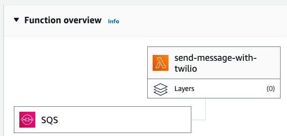

# AWS Lambda function for Twilio SMS

This lambda function accepts messages from an SQS queue and sends each message to the specified phone number using your Twilio account. It requires no external dependencies and can be pasted directly into the AWS Lambda Code Source editor and run right away. 

If you already have a Twilio account, this is a great way to get started with SMS in AWS without having to re-register for a new phone number through a new provider.

## Environment variables

The following three environment variables are required:

`TWILIO_ACCT_SID` &mdash; can be found on the Twilio Console page under **Account SID**

`TWILIO_AUTH_TOKEN` &mdash; can be found on the Twilio Console page under **Auth Token**

`DEFAULT_MESSAGE_SENDER` &mdash; can be found on the Twilio Console page under **My Twilio phone number**, should be in the format of `+15551235555`

## Test Event

Once you create the lambda function, paste the code from `lambda_handler.py` into your AWS lambda code editor, and hit the **Deploy** button, you can test that it is working by using the following test event.

**Please replace the +15551235555 with your own phone number**

```
{
  "Records": [
    {
      "body": "{\"message\": \"Testing SMS from mock SQS event\", \"phone\": \"+15551235555\"}"
    }
  ]
}
```

## SQS Integration

This function is designed to be triggered by an SQS queue, as shown below. 



To send a message to your SQS queue from a different lambda function, use the following python code:

```
import boto3
sqs = boto3.client("sqs")
message_body = {
    "message": "Testing SMS from real SQS queue",
    "phone": "+15551235555",
}
sqs.send_message(
    QueueUrl="https://sqs.us-east-1.amazonaws.com/acct_id/queue_name",
    MessageBody=json.dumps(message_body)
)
```